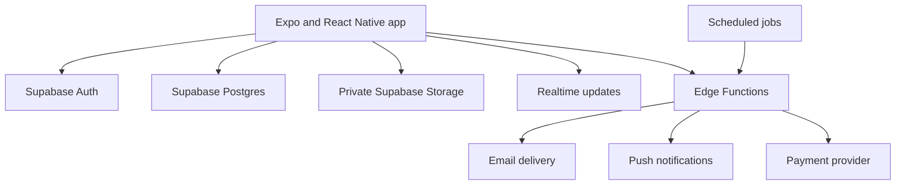

# EverNest

EverNest is a private family memory app for capturing everyday moments, collaborating with guardians, and scheduling stories to arrive as future time capsules.

## Product scope

EverNest treats a memory as more than a photo. A family can attach written or voice context, organize moments around children and milestones, invite trusted guardians, and preserve selected memories for future delivery.

- Email-based authentication and profile setup
- Family workspaces and guardian invitations
- Photo, video, note, and voice context
- Daily timeline grouped by date
- Comments and reactions
- Child profiles and milestone templates
- Daily and catch-up reminders
- In-app and push-notification foundations
- Scheduled time capsules and recipient email delivery
- Data export and account-deletion workflows
- Billing integration foundations

## Architecture



The mobile bundle contains only public client configuration. Privileged operations run in Supabase Edge Functions. Family records and storage objects are scoped through Row Level Security and family-based storage paths.

## Security defaults

- Row Level Security across family-owned data
- Private media buckets scoped by family identifier
- Invitation tokens stored as hashes rather than plaintext
- Service-role and payment secrets restricted to server functions
- Validation at client and function boundaries
- Audit events around invitation flows
- Secure local storage for device-side session material

See [`docs/SECURITY.md`](./docs/SECURITY.md) and [`docs/THREAT_MODEL.md`](./docs/THREAT_MODEL.md) for the detailed boundaries and remaining risks.

## Stack

- Expo, React Native, and TypeScript
- Expo Router
- Supabase Auth, PostgreSQL, Storage, Realtime, and Edge Functions
- TanStack Query
- NativeWind and Moti
- Expo notifications, media, audio, secure storage, and sharing APIs
- Paystack or Dodo billing foundations

## Local development

```bash
pnpm install
pnpm start
```

Apply the SQL migrations in `supabase/sql`, deploy the functions in `supabase/functions`, and configure the public application values described in the existing setup documentation.

Useful checks:

```bash
pnpm typecheck
pnpm lint
```

## Documentation

- [Architecture](./docs/ARCHITECTURE.md)
- [Security](./docs/SECURITY.md)
- [Threat model](./docs/THREAT_MODEL.md)
- [Deployment](./docs/DEPLOYMENT.md)
- [Roadmap](./docs/ROADMAP.md)

## Project status

EverNest is an active mobile product prototype. It should not claim production readiness until notification delivery, billing, exports, account deletion, media retention, backup recovery, and multi-device behaviour have complete automated and operational validation.
